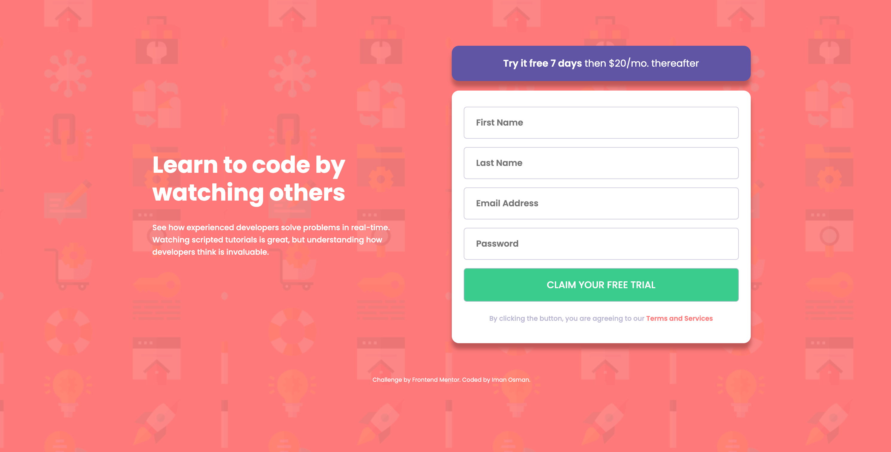

# Frontend Mentor - Intro component with sign up form solution

This is a solution to the [Intro component with sign up form challenge on Frontend Mentor](https://www.frontendmentor.io/challenges/intro-component-with-signup-form-5cf91bd49edda32581d28fd1).

## Table of contents

- [Overview](#overview)
- [Focus](#focus)
- [Outcome](#outcome)
- [Built with](#built-with)
- [Lessons](#lessons)

## Overview

This challenge asks that I create a signup form that uses JavaScript to check for format validity and empty fields, with error messages shown.

## Focus

My focus here is to build on my knowledge of HTML forms and client-side validation. I've done a project previously with validity checks - see [Ping-coming-soon](https://github.com/i000o/ping-coming-soon.git). This one includes a password and more input fields.

## Outcome

I'm happy with the outcome. It didn't take too much time. I felt more practiced using validity checks, I understand more the JavaScript I'm writing. Styling is easy and I can do it with confidence, but I can always learn more about Flex layouts. The media queries on this one took me some time. I'm happy with the way I worked through the error messages which show on incorrect inputs, too.

:jigsaw: [Live Site URL](https://i000o.github.io/intro-component-signup-form/)  
:pencil2: [Solution URL](https://www.frontendmentor.io/solutions/intro-component-with-sign-up-client-side-validation-checks-bHRvyK3N2K)

## Built with

:gear: Semantic HTML5 markup  
:gear: CSS  
:gear: Sass
:gear: Mobile-first workflow  
:gear: JavaScript

## Time taken

Approx. 8hrs

## Lessons

1. `novalidate` - _"The novalidate attribute is a way to tell the browser: 'Don’t handle the form validation for me.'... When you add `novalidate`, you're instructing the browser to bypass the automatica validation. That means you take full control of how to validate the input fields."_ AI explaination I found useful on this. I learnt this debugging why my error message ``'s weren't showing up.
2. The important of space/no space with CSS combinator selectors. For instance, I had written `input .input-error` which was wrong becaused this calls for descendants of `<input>`. Instead, I needed to remove the space, making a compound selector which looks for _both_, rather that one within the other.
3. `<input type="password">` for passwords to obscure the text.
4. I think the media queries took me the longest. I had to work through them breakpoint by breakpoint. I don't normally do them this way, but I found it most effective. Although it takes time and focus, it's worth it to make the layout fully flow nicely throughout viewports. I want to get much better and faster at these in future.

# intro-component-signup-form
